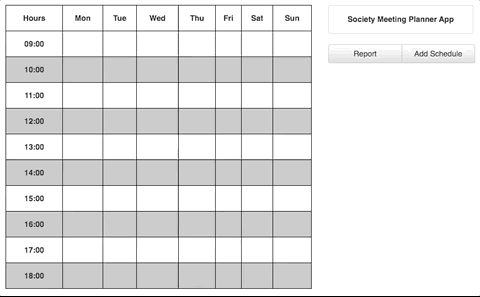

This is a *learning* project aimed at ReactJS apps. Its purpose is to find overlapping time slots when you have many different time schedules and manually finding overlaps seems infeasible. The name comes from the time when I was a student at the [University of Stirling](https://www.stir.ac.uk/) and was helping the committee of the Public Speaking Society (sadly it is now defunct...).

See a quick demo here:

[https://alexkuc.github.io/society-meeting-planner/](https://alexkuc.github.io/society-meeting-planner/)

>**Warning** This project was created in 2017 and was **never** meant to be used in live production! At this point, it fails to compile as a result of dependencies upgrades which were necessary due to security warnings. If the online preview works fine for you, you can download it from [gh-pages branch](https://github.com/alexkuc/society-meeting-planner/tree/gh-pages) (if you get a white page, adjust the path of assets - css and js). **Warning**

For more technical details, see [Addendum.MD](Addendum.MD).
